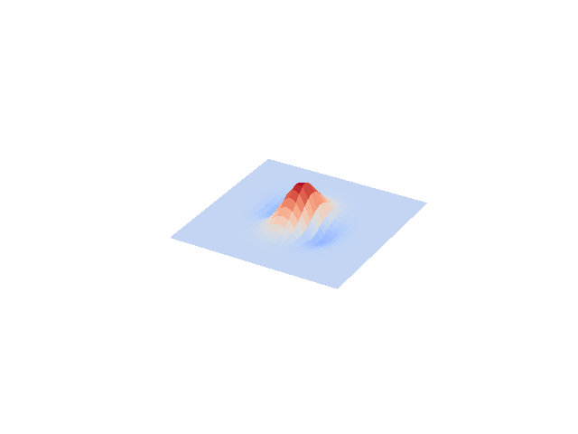

# physics-hackathon-2021

## Membrane vibration with energy dissipation based on temperature

# Overview

Make some noise! 

You take the sound of a hammer banging on a nail, some random person screaming at an auction or perhaps record the residual noise from the birth of the universe and put these sounds together in a cohesive rhythmic way and, if done right, you might have yourself a piece of music!

The point is: we are surrounded by a ton of cool sounds/signals that can be used to make music. So why not simulate some of the systems around us in a mega bruteforce way and     H E A R     T H A    D A R N    T H I N G. This is what we're doing here. 

In a normal setting, you don't hear the thermal fluctuations affecting your guitar string or your drumhead when you play it, but let's be hardcore. Would the quality of that sound depend on the temperature? These were some of the motivating questions for our project. By combining the classical vibrations of a surface with characteristic surface thermal fluctuations, we have attempted to model a physically valid membrane which can, in principle, be parametrized to play different sounds.

# The combination of the two vibrations 

Using odeint solve in the Numpy library, we were able to model the vibrations on the surface as a function of the tension associated with the neighbouring points. At each time step, the energy functional is evaluated and the next state of that system established with the following formula: 

The additional fluctuations add some noise to the classical vibrations that would mimic the behaviour of an energy dissipating membrane (as will be heard?)

I'm realizing I do not understand what is going on nearly well enough....
